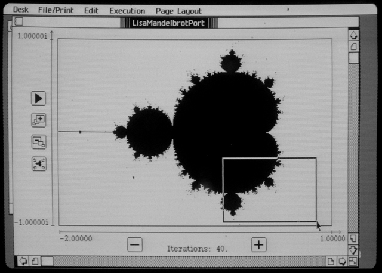

LisaMandelbrot Port
===================

LisaMandelbrot Port is an interactive program for the Lisa Office System that
plots the Mandelbrot set on the Lisa's display. Using the mouse, the user can
zoom into smaller regions of the complex plane for detailed rendering of
portions of the set.

Unlicense
---------

LisaMandelbrot Port and any supporting programs, software libraries, and
documentation distributed alongside it are released into the public domain
without any warranty. See the LICENSE file for details.

Running LisaMandelbrot Port
---------------------------

The binary distribution of LisaMandelbrot Port has been tested with versions
3.0 and 3.1 of the Office System; support for other versions is doubtful.
To run the compiled binary distributed on the
[`LisaMandelbrotPort.dc42`](LisaMandelbrotPort.dc42) disk image, copy the image
onto a diskette via conventional means, (e.g. Disk Copy 4.2,
[BLU](http://sigmasevensystems.com/BLU.html)), insert the diskette into the
drive while the Office System is running, and either run LisaMandelbrot Port
directly from the diskette or copy the program to the hard drive first.
LisaMandelbrot Port does not create documents; it is a "desk accessory" like
the Calculator or the Clock.

Usage instructions and notes
----------------------------

LisaMandelbrot Port uses the QuickPort application development framework, which
has limited facilities for programs that frequently update the graphical
contents of their display windows. The program takes some steps to overcome
QuickPort's shortcomings in this regard (this accounts for the frequent
"blinking" refresh of the program's display), but problems can still occur if
QuickPort gets "overwhelmed" with graphical updates. For this reason, **users
are advised to pause any calculation of the Mandelbrot set before scrolling the
LisaMandelbrot Port window or switching to another window.**

The zooming functionality of LisaMandelbrot Port does not appear to work in
version 1.2.6.2 of the [LisaEm Apple Lisa emulator](http://lisa.sunder.net).

LisaMandelbrot Port can't zoom _too_ deeply into the Mandelbrot set. The limit
on zooming relates to the resolutions at which individual pixels map evenly
onto the 16-bit fixed point numbers LisaMandelbrot Port uses in its complex
number representation. See **Technical details** below for more information on
this representation, and comments around the constant definitions in
[`MANDELQP.TEXT`](MANDELQP.TEXT) for further details on zooming limitations.

Users create and move zoom boxes by clicking in the graph window. A click
within a zoom box causes the zoom box to follow the mouse until the user clicks
again; a click outside of a zoom box causes the user to begin drawing a new
zoom box, which they complete by clicking a second time. Any click outside
of the graph window clears away any zoom box present in the graph window.

All other program control is achived through buttons in the LisaMandelbrot Port
window. Proceeding from top to bottom and left to right in the screenshot above,
the buttons are:

  - **Play/Pause** - Pause or restart/resume any plotting of the set.
  - **Zoom in** - Make the area in the zoom box fill the graph window. Plotting
    will restart automatically.
  - **Zoom out** - Shrink the area in the graph window so that it only fills
    the area covered by the zoom box. Plotting will restart automatically.
  - **Reset** - Reset the graph window to the default area of the complex plane.
  - **Minus** - Decrease the number of iterations of `z' = z^2 + c`.
  - **Plus** - Increase the number of iterations of `z' = z^2 + c`.

Building LisaMandelbrot Port
----------------------------

The implementation for LisaMandelbrot Port spans three files:
[`MANDLIB.ASM.TEXT`](MANDLIB.ASM.TEXT), the core assembly language routines for
complex number calculations; [`MANDLIB.TEXT`](MANDLIB.TEXT), general purpose
routines for numerical conversions and zooming; and
[`MANDELQP.TEXT`](MANDELQP.TEXT), the main LisaMandelbrot Port program. The
files [`QPMAKE.TEXT`](QPMAKE.TEXT) and [`QPOBJS.TEXT`](QPOBJS.TEXT)
are an EXEC script and a library listing that help build the program. Copy
all of these files to a hard drive installation of version 3.0 of the Workshop,
**prefixing all filenames with** `LM/` (e.g. `LM/MANDLIB.ASM.TEXT`). Be sure
that all files from diskettes #8 and #9, as well as the `Comp.TEXT` file from
diskette #8, are also present on the hard drive.

Insert a diskette **initialised by the Office System** into the disk drive.
Then, at the main Workshop command prompt, type:

    R
    <LM/QPMAKE

to run the build script. LisaMandelbrot Port will be installed onto the
diskette.

Alternately, copy all files with the `LM/` prefix from the
[`LisaMandelbrotPort.dc42`](LisaMandelbrotPort.dc42) disk image onto the
Workshop hard drive, then execute the `LM/QPMAKE` script with an Office
System-initialised diskette as described above.

Version 3.9 of the Workshop has different floating point libraries than version
3.0 and cannot compile LisaMandelbrot Port.

Technical details
-----------------

LisaMandelbrot Port uses a 32-bit fixed-point complex number representation.
The signed imaginary part of the complex number sits in the most significant 16
bits of the longword, and the signed real part sits in the least significant 16
bits. The real and and imaginary parts can range from -2.0 (`$8000`) to around
1.99994 (`$7FFF`) in evenly-spaced increments.

LisaMandelbrot Port cuts off the iteration of the equation `z := z*z + c` when
the absolute value of either the real or the imaginary part would exceed 2.
This escape may come later than a vector magnitude > 2 cutoff, but it's
certainly computationally simpler.

Revision history
----------------

5 March 2017: Initial release.
(Tom Stepleton, stepleton@gmail.com, London)
