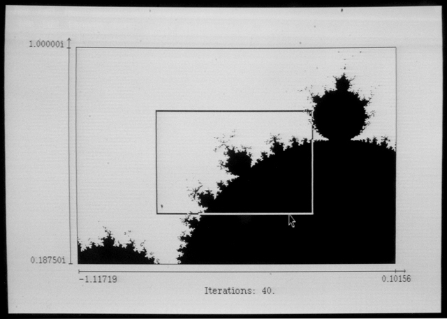

LisaMandelbrot Pro
==================

LisaMandelbrot Pro is an interactive program for the Lisa Workshop that plots
the Mandelbrot set on the Lisa's display. Using the mouse or keyboard, the user
can zoom into smaller regions of the complex plane for detailed rendering of
portions of the set.

While the user can create and move zoom boxes with the mouse, much of
LisaMandelbrot Pro's functionality is available through the keyboard only.
The keyboard commands are documented in this file and at the top of
[`MANDELQD.TEXT`](MANDELQD.TEXT). There is no in-program help facility.

There is nothing particularly professional about LisaMandelbrot Pro; the name
reflects the spartan user interface and the fact that it runs in the Workshop,
which is presumably where all the pros hang out.

Unlicense
---------

LisaMandelbrot Pro and any supporting programs, software libraries, and
documentation distributed alongside it are released into the public domain
without any warranty. See the LICENSE file for details.

Running LisaMandelbrot Pro
--------------------------

The binary distribution of LisaMandelbrot Pro has been compiled in version 3.0
of the Workshop; other versions have not been tested. To run the compiled
binary distributed on the [`LisaMandelbrotPro.dc42`](LisaMandelbrotPro.dc42)
disk image, copy the image onto a diskette via conventional means, (e.g. Disk
Copy 4.2, [BLU](http://sigmasevensystems.com/BLU.html)), insert the diskette
into the drive while the Workshop is running, and then, at the main Workshop
prompt, type `r` (run), then `-LOWER-MANDELQP.EXE`.

Usage instructions and notes
----------------------------

The zooming functionality of LisaMandelbrot Pro does not appear to work in
version 1.2.6.2 of the [LisaEm Apple Lisa emulator](http://lisa.sunder.net).

LisaMandelbrot Pro can't zoom _too_ deeply into the Mandelbrot set. The limit
on zooming relates to the resolutions at which individual pixels map evenly
onto the 16-bit fixed point numbers LisaMandelbrot Pro uses in its complex
number representation. See **Technical details** below for more information on
this representation, and comments around the constant definitions in
[`MANDELQD.TEXT`](MANDELQD.TEXT) for further details on zooming limitations.

LisaMandelbrot Pro's keyboard commands are optimised for the numeric keypad.
They are:

    7: Shrink the zoom box.
    1: Grow the zoom box.
    .: (also , for some European keyboards) Reset the zoom box to be the same
       size as the graph window.

    2, 4, 6, 8: Pan the zoom box around the graph window.

    9: Zoom in---make the area in the zoom box fill the graph window. Plotting
       restarts automatically.
    3: Zoom out---shrink the area in the graph window so that it only fills
       the area covered by the zoom box. Plotting restarts automatically.

    0: Toggle "fast panning": panning in multiple-pixel steps. Fast panning is
       disabled by default.

    5: Recalculate and redraw the plot for the current graph window. Useful when
       changing the number of iterations (see below).

    (Keypad right arrow): (also 'p' and ' '): Pause/unpause any calculation and
       plotting of the set currently underway.

    (Keypad up arrow): Increase the number of iterations of z' = z^2 + c.
    (Keypad down arrow): Decrease the number of iterations.

    r: Reset the graph window to the default area of the complex plane.

    q: Quit the program.

Diagrammatically, this is:

    .- - - - .- - - - .- - - - +--------+
    :        :        :        | [>]    |
    :        :        :        |  Pause |
    :        :        :        |        |          Plus:
    +--------+--------+--------+--------+
    | 7      | 8      | 9      | [^]    |         +--------+
    | Shrink |  Pan   |  Zoom  |  Fewer |         | R      |
    |  Box   |  Up    |  In    |  Iters |         |  Reset |
    +--------+--------+--------+--------+         |  Graph |
    | 4      | 5      | 6      | [v]    |         +--------+
    |  Pan   | Redraw |  Pan   |  More  |
    |  Left  |  Graph |  Right |  Iters |          and
    +--------+--------+--------+--------+
    | 7      | 8      | 9      |        :         +--------+
    |  Grow  |  Pan   |  Zoom  |        :         | Q      |
    |  Box   |  Down  |  Out   |        :         |  Quit  |
    +--------+--------+--------+        :         |        |
    | 0               | . or , |        :         +--------+
    |  Toggle Fast    |  Reset |        :
    |  Panning        |  Zoom  |        :
    +-----------------+--------+ - - - -'

Zoom boxes can also be created and moved by making typical click and drag
actions with the mouse. Click outside the graph window to reset the zoom box to
the graph window's current zoom. For the moment, the zoom box can't be resized
via mouse actions---use the keyboard or draw a new zoom box instead.

Ordinarily the zoom box is shown as a rectangular border, but if it covers an
area smaller than the maximum zoom supported by LisaMandelbrot Pro, it becomes
a solid rectangle. For these zoom boxes, LisaMandelbrot Pro can only zoom out.

Building LisaMandelbrot Pro
---------------------------

The implementation for LisaMandelbrot Pro spans three files:
[`MANDLIB.ASM.TEXT`](MANDLIB.ASM.TEXT), the core assembly language routines for
complex number calculations; [`MANDLIB.TEXT`](MANDLIB.TEXT), general purpose
routines for numerical conversions and zooming; and
[`MANDELQD.TEXT`](MANDELQD.TEXT), the main LisaMandelbrot Pro program. The
files [`BUILD.TEXT`](BUILD.TEXT), [`COMPILE.TEXT`](COMPILE.TEXT), and
[`LINK.TEXT`](LINK.TEXT) are EXEC scripts that help build the program. Copy
all of these files to a hard drive installation of version 3.0 of the Workshop,
**prefixing all filenames with** `LM/` (e.g. `LM/MANDLIB.ASM.TEXT`). Be sure
that the QuickDraw libraries and support files from Workshop installation
diskette #9 are also present on the hard drive. Then, at the main Workshop
command prompt, type:

    R
    <LM/BUILD

to run the build script. The executable file it creates is named
`LM/MANDELQD.EXE.OBJ`. To run, type `R` and then `LM/MANDELQD.EXE`.

Alternately, copy all files with the `LM/` prefix from the
[`LisaMandelbrotPro.dc42`](LisaMandelbrotPro.dc42) disk image onto the Workshop
hard drive, then execute the `LM/BUILD` script as described above.

Version 3.9 of the Workshop has different floating point libraries than version
3.0 and cannot compile LisaMandelbrot Pro.

Technical details
-----------------

LisaMandelbrot Pro uses a 32-bit fixed-point complex number representation.
The signed imaginary part of the complex number sits in the most significant 16
bits of the longword, and the signed real part sits in the least significant 16
bits. The real and and imaginary parts can range from -2.0 (`$8000`) to around
1.99994 (`$7FFF`) in evenly-spaced increments.

LisaMandelbrot Pro cuts off the iteration of the equation `z := z*z + c` when
the absolute value of either the real or the imaginary part would exceed 2.
This escape may come later than a vector magnitude > 2 cutoff, but it's
certainly computationally simpler.

Revision history
----------------

5 March 2017: Initial release.
(Tom Stepleton, stepleton@gmail.com, London)
