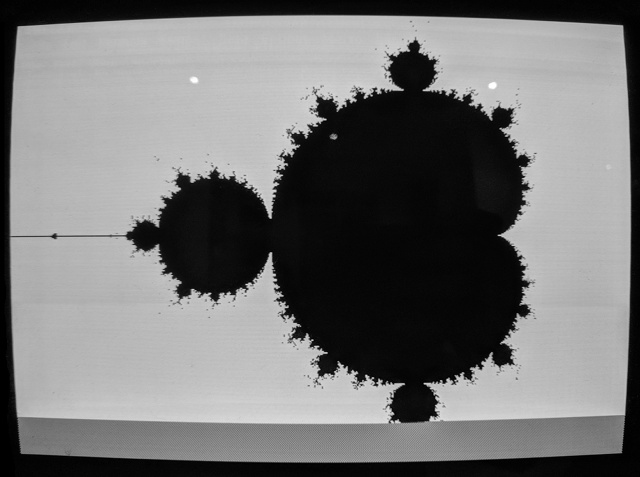

LisaMandelbrot Solo
===================

LisaMandelbrot Solo is a standalone "bare metal" assembly program that plots
the Mandelbrot set on a Lisa's display. Once it finishes plotting the set the
first time, the program plots the set again with its horizontal position
shifted slightly, scrolling new lines up from the bottom of the screen. This
process continues indefinitely.

LisaMandelbrot Solo may be useful for power supply burn-in tests, or for other
tasks where it could be useful to have the Lisa running "hands off" for a while
without the screen dimming. Nevertheless, there is no guarantee that
LisaMandelbrot is suitable for avoiding screen burn-in (or any other sort of
damage to your Lisa) under these or any other circumstances.

Unlicense
---------

LisaMandelbrot Solo and any supporting programs, software libraries, and
documentation distributed alongside it are released into the public domain
without any warranty. See the LICENSE file for details.

Running LisaMandelbrot Solo
---------------------------

To run the binary distribution of LisaMandelbrot Solo, obtain the `.dc42` file
appropriate for your system: `LisaMandelbrot_twiggy.dc42` for Lisa 1 systems,
or `LisaMandelbrot_sony.dc42` for Lisa 2s. Copy the disk image onto a diskette
via conventional means (e.g. Disk Copy 4.2,
[BLU](http://sigmasevensystems.com/BLU.html)) and boot from the diskette.
Lisa 2 systems will eject the diskette immediately on boot. Afterward, the
Mandelbrot set plotting begins.

While running LisaMandelbrot Solo, the Lisa pays no attention to input of any
kind---not even the power button. To stop the program, you will either need to
press the reset button on the back of the computer, or cut off power to your
Lisa altogether.

Building LisaMandelbrot Solo
----------------------------

LisaMandelbrot Solo is written entirely in the dialect of 68000 macro assembly
supported by the open-source [EASy68K](http://www.easy68k.com/) development
environment and simulator. EASy68K is a Windows program which is well-behaved
on MacOS X, Linux, and similar systems with the use of the Wine compatibility
layer. Converting LisaMandelbrot Solo's source code to be compatible with other
popular assemblers should not be too difficult.

A few configuration options are present and documented in the source code:
these control whether LisaMandelbrot Solo attempts to eject the diskette in the
Lisa's disk drive (currently supported only for Boot ROM H Lisa 2 systems);
whether a line of dots is shown at the bottom of the screen after scrolling;
and the number of times LisaMandelbrot Solo iterates the equation
`z := z*z + c` before deciding that point `c` is in the Mandelbrot set.

EASy68K compiles the LisaMandelbrot Solo source code (`LisaMandelbrot.X68`) to
a Motorola S-record file (`LisaMandelbrot.S68` by default). Once created, the
S-record file may be converted into raw binary code with the `EASyBIN.exe`
program distributed with EASy68K, or with the `srec_cat` program distributed
with the [SRecord](http://srecord.sourceforge.net/) package for UNIX systems,
among many other options. An example invocation of `srec_cat` is:

    srec_cat LisaMandelbrot.S68 -offset -0x800 -o LisaMandelbrot.bin -binary

Finally, use the `dc42_build_bootable_disk.py` script distributed with the
["Stepleton" bootloader](http://github.com/stepleton/bootloader) to complete
the creation of a bootable `.dc42` floppy disk image from the raw binary file
emitted by `srec_cat`.

Technical details
-----------------

LisaMandelbrot Solo uses a 32-bit fixed-point complex number representation.
The signed imaginary part of the complex number sits in the most significant 16
bits of the longword, and the signed real part sits in the least significant 16
bits. The real and and imaginary parts can range from -2.0 (`$8000`) to around
1.99994 (`$7FFF`) in evenly-spaced increments.

LisaMandelbrot Solo cuts off the iteration of the equation `z := z*z + c` when
the absolute value of either the real or the imaginary part would exceed 2.
This escape may come later than a vector magnitude > 2 cutoff, but it's
certainly computationally simpler.

Revision history
----------------

22 November 2017: Initial release.
(Tom Stepleton, stepleton@gmail.com, London)
